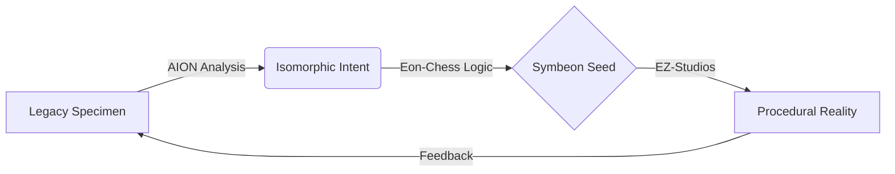

# Sovereign Codex: The Infinite Code Renaissance 🛡️💎🕶️

> **ARCHIVE → BRIDGE → SEED → GENERATE**

The **Sovereign Codex** is the core methodology of the **EZ-Fundation**. It is the unified workflow designed to rescue legacy digital artifacts and transmute them into sovereign, procedural, and infinite experiences.

[**English**](README.md) | [**Português**](README_PT.md)

---

## 🏛️ The Three Pillars

The protocol operates through the synergy of three architectural pillars:

1.  **Archaeology (AION-Core):** Extracting "Digital DNA" and logic from binaries.
2.  **Logic (Eon-Chess):** Distilled, pure algorithmic mastery for decision-making.
3.  **Generation (EZ-Studios-Core):** Using the **Holistic Generation Framework (HGF)** to expand seeds into procedural realities, deployed via the **Engine Optimization Matrix**.

---

## 🔄 The Symbeon Workflow

## 🌌 Our Philosophy
We believe that no code is ever truly dead. In the depths of every obsolete binary lies a sequence of human creativity worth preserving. The Sovereign Codex is the bridge that allows this creativity to transcend its original hardware and bloom in the era of Artificial Intelligence.

## 🛠️ Technical Standards
For detailed information on data exchange formats, see [SPECIFICATION.md](SPECIFICATION.md).

---
**Sovereignty through Transmutation.**
*EZ-Fundation - 2026*
